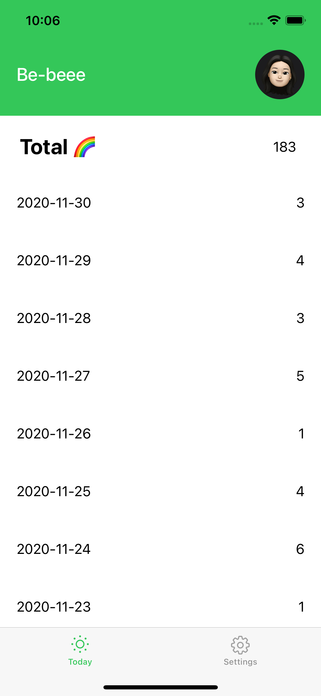
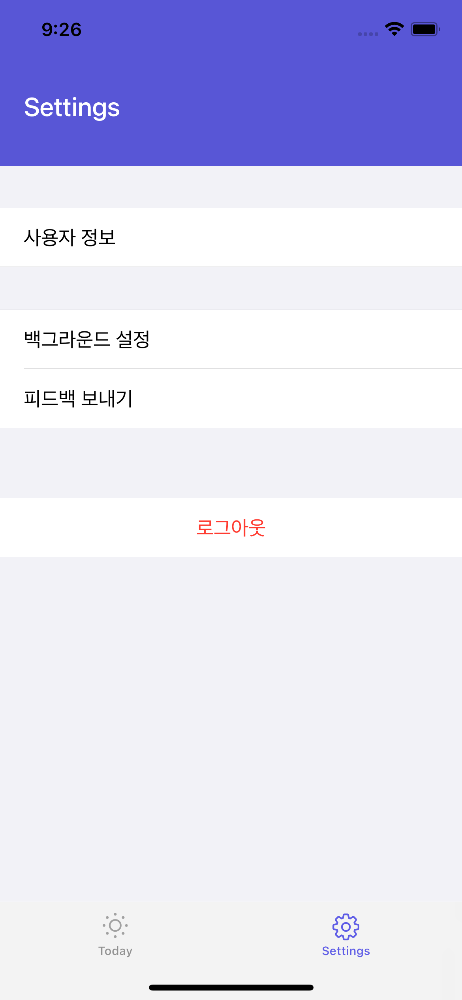
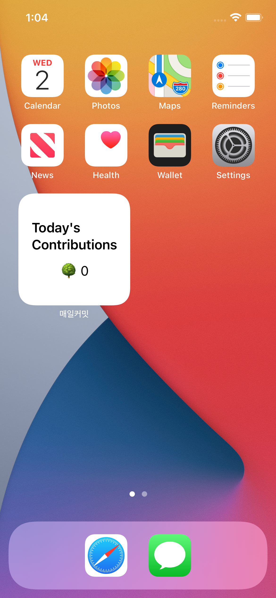

# everyday-commit

1일 1커밋을 생활화합시다!👩‍💻 사용자의 오늘의 커밋 수를 위젯으로 표시해주는 iOS 애플리케이션입니다🔥 
현재 앱스토어 등록 진행 중입니다 ✨

- 개발 기간: 2020.11 - 2020.12
- 개발 인원: 1명
- 개발 언어 및 환경: Swift, SwiftUI, Xcode, REST API
 
 
 

## 주요 기능 소개

- 깃허브로 로그인하기: 깃허브로 로그인해서 사용자의 최근 10일 간 커밋 기록을 확인할 수 있습니다.👩‍💻

	
    

 
 
 

- 설정: 사용자 정보 확인 및 백그라운드 설정이 가능합니다. 원하는 색상과 이모지로 앱 메인 컬러 및 위젯 컬러를 변경할 수 있습니다👍 (더 많은 색상과 이모지가 추가될 예정입니다!)

	
	
	

 
 
 

- 위젯: 위젯을 통해 오늘의 커밋 수를 확인할 수 있습니다! 1일 1커밋 도전에 활용해보세요😎

	
	
	

